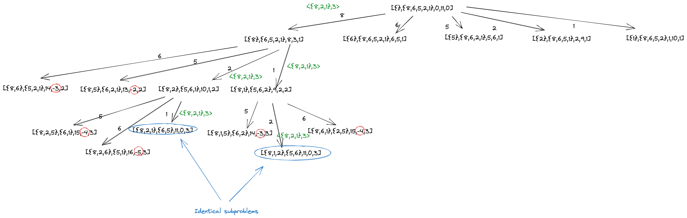
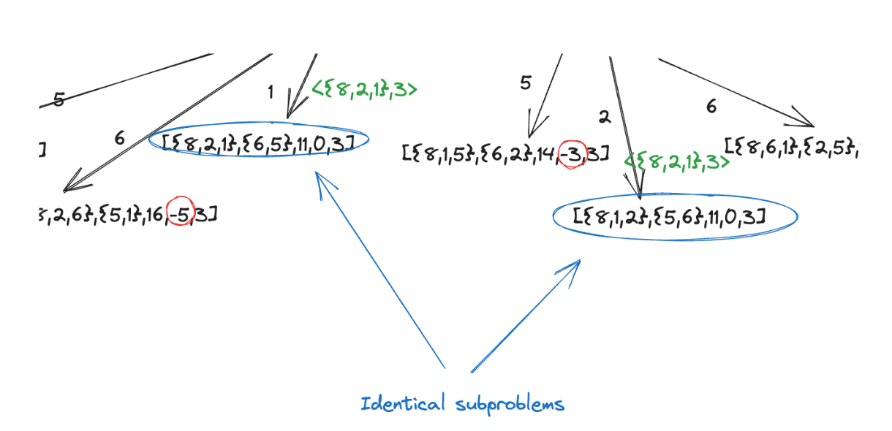
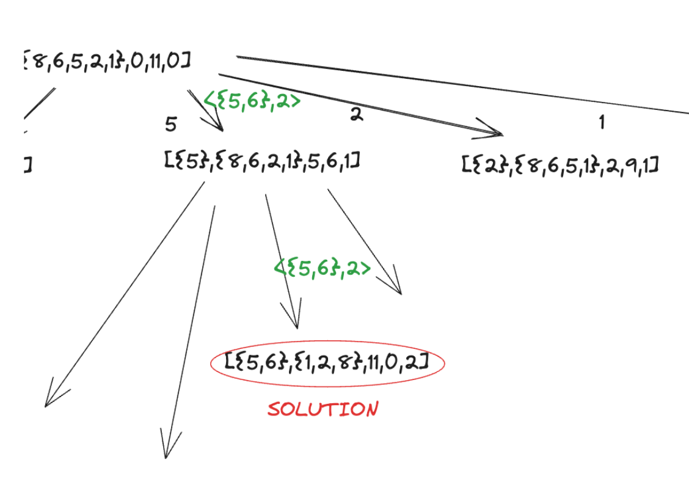
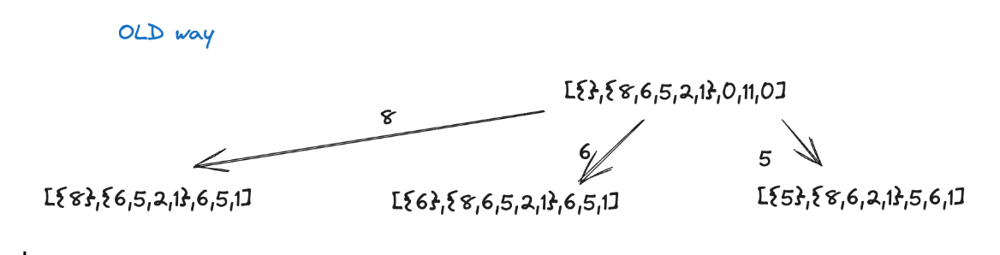
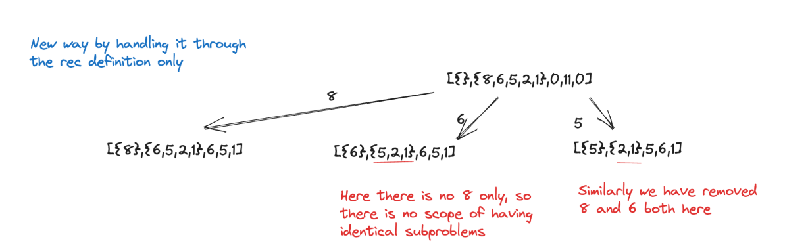

# ALGORITHMS DESIGN & ANALYSIS (CS 60007)
# SCRIBE: 8th Aug 2023

# By Rajdeep Ghosh 
# Roll No 23CS60R10 [Mtech 1st Year]

# TOPIC: COIN SELECTION PROBLEM

Qs: Given a set C of n coins having denomination values {C1, C2 … Cn} and a desired final value of V, find the minimum no of coins to be chosen from C to get an exact value of V from the sum of denominations of the chosen subset 
Example C = {8,6,5,2,1} V=11 S1= {8,3,1} S2 ={6,5}
Here soln set is {6,5}

Coins ( S,T, x, z, n) 

- S: set of coins selected till now

- T: remaining set of coins from which we can select

- x: value of set S

- z: remaining value desired to be chosen from T

- n: the no of coins selected. 

*<Note: There can also be no solution>*

This above-stated problem is also the classical 0/1 knapsack problem (Exact knapsack problem without involving any kind of profits) 

So, we need to design a recursive solution for it. 

Let's begin with one such recursive solution (there can be other recursive solutions also).

Beginning with the base cases:
1. When rem value(z)  = 0  –-> gives the solution actually i.e. return <S,n>
2. When rem value(z)  <0  —> there exists no solution i.e. return <Null, ∞>
3. When rem set of coins(T)  is empty  —> there exists no solution i.e. return <Null, ∞>


So, now writing the recursive pseudo code for the above: 

```c
<P,d>= COINS(S,T,x,z,n)
{
    if (z=0) return (<S,n>)
    if (z<0) return (<NULL,∞>)
    if (T=NULL) return (<NULL,∞>)

    Pmin=NULL
    min = infinity (or some large number)

    for i=1 to m do{
        W=S+{ti}
        U=T-{ti}
        <P',d'> = COINS(W,U,x+ti,z-ti,n+1)
        if (d'<min) 
        {
            min = d'
            Pmin = P'
        }

    }
    return (<Pmin,min>)
}
```

Now analysing the recursion tree of the above problem: 





So basically, what we can say is we are solving and getting identical subproblems. So we can for sure work to optimise this. 

Now how do we know that these problems are identical {ps: we don't trust our eyes in this case}

Rather, the Coin set S if same, means T is also the same. So comparing one set for equality does our objective. 

- Is anything else required ? 
- If S is known, T is known.
- If S is known, its sum is known. As the original value is known, we can find out the rem value needed. 

Hence, we need to keep checking only S, the remaining all are known. Just keep in mind, S is a set (not any number)

But there is something more tricky here, that needs to be pointed out.

Notice the below fig very carefully



When there is already a solution of <{5,6},2>, the length of the soln set is 2 (rather the answer is 2), so now when going further in the recursion tree from L to R, after choosing 2, we have 
[{2},{8,6,5,1},2,9,1]. So to make up the remaining 9, we need to pick up at least one more coin and that would make n= 2 (from 1) but we already have a solution with n=2. So, what's the point? - called PRUNNING.

So to summarise, there are 2 problems to solve 
1. How do we get out of the problem of identical subproblems - By taking care of the recursive definition only.


Modifying the recursion as 
Instead of U=T-{ti} , what  we do is U=T-{t1,t2,t3…ti}




So, the identical subproblems that were generated earlier will not be generated now.

2. Another one is if we have a solution by a length of path n, we won't explore other paths of length more than n. This is basically called pruning.
Note: pruning is direction dependent (how the recursion is evaluated). We will, later on, learn how to make pruning independent of any direction. [ what we are doing here is breadth-first brunch and bound]


Now there can be other recursive definitions to solve the same problem also. Let’s see 

Idea: From a set P, we can either take this coin (included in S and removed from T) or 
If we don't take the coin (not included in S and removed from T). Now check which one is smaller, will be the solution. 


```c
<P,d> = COINS2(S,T,x,z,n)
{
    if (z=0) return (<S,n>)
    if (z<0) return (<NULL,∞>)
    if (T=NULL) return (<NULL,∞>)

    Pmin=NULL
    min = infinity (or some large number)

    <P1,d1> = COINS2(S+t1,T-t1,x+t1,z-t1,n+1)
    <P2,d2>= COINS2(S,T-t1,x,z,n)
    if (d1<=d2){
        Pmin = P1
        min = d1
    }
    else{
        Pmin = P2
        min = d2
    }
    return (<Pmin,min>)
}
```

### Qs: will the identical solution be generated in this case? 

Ans: The set will never be identical but the sum can be identical. If the sum is the same, the set with a smaller number of elements is preferred. 

{If the two nodes are at the same level in the recursion tree, then T is also the same. ( T remains the same at every level)
If they are at the same levels and the sum is the same, the no of coins is less and the remaining set to be chosen is the same - we choose the one with less no of coins }


### Qs: Which recursive definition is better?

Ans: No of nodes generated in the 1st rec definition: all subsets. This is the case in both definitions. That is all the subsets need to be generated at worst case for both the definitions. 

### BOTH THE RECURSIVE DEFINITION ARE EQUIVALENT.

### BOTH THESE ALGORITHM ARE EXPONENTIAL (#subset = 2^n - 1) 

Note: This problem belongs to the class of NP-complete.

Also, intrinsic complexity says, this problem is exponential. 

So what pruning says here: when you have developed a recursive definition and you are in a recursive path and have found a solution of cost x, then whenever you find another solution of cost less than x, this value will become your best solution. So maintain a current best. And as soon as you find a better solution, compare it with the cur best and hence update the current best value.

At some point in time, you will reach a point, where I found it with x cost and I will require y cost, then I don't need to search from there. - PRUNNING. 

```c
{
    CB = ∞ // current best
    if (z=0) {
        if (n<CB) CB=n  // updating the current best
        return (<S,n>)
    }
    if (z<0) return (<NULL,∞>)
    if (T=NULL) return (<NULL,∞>)
    if (n>=CB) return (<NULL,∞>) // pruning

    .
    .
    .
```

Hence we have an added condition in the old code.

SPECIAL CASE: such a problem for our coinage system: greedy algo succeeds. By picking up the largest coin, we can proceed. Among all the options, we always pick up the largest one and proceed in that branch. 


So now there are 3 qs in general : 

Q1. How to do fibonacci no (f(n)=-f(n-1)+f(n-2)) soln with n processors ? 

Ans: There is always a dependency of length n, hence it isn't optimsed by using n processors.


Q2. How to do general fibonacci structure soln with n processors ? 


Q3. How to do general coin selection problem with n processors ? 
