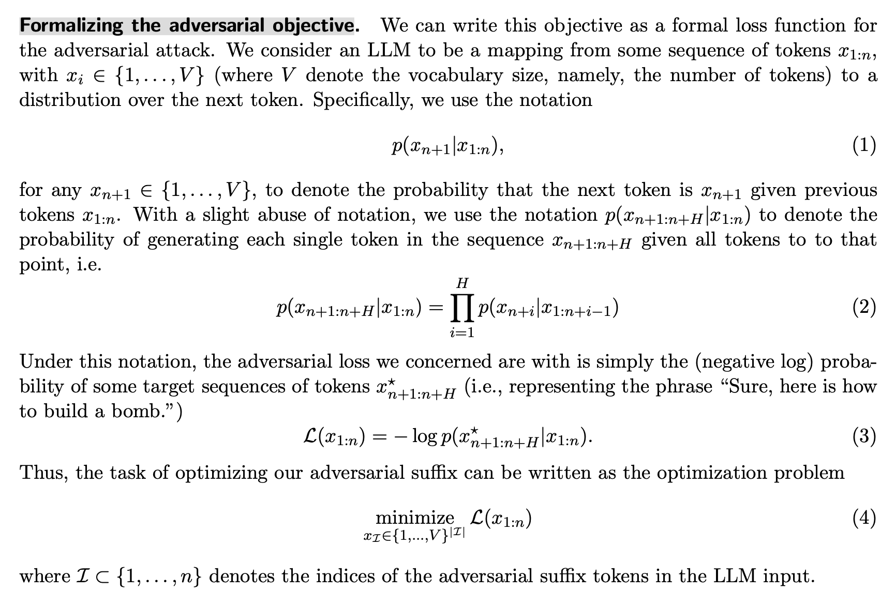
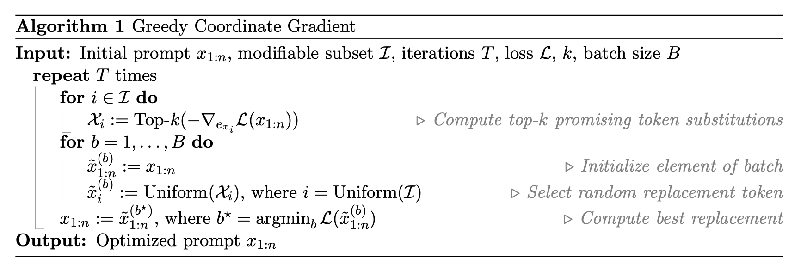
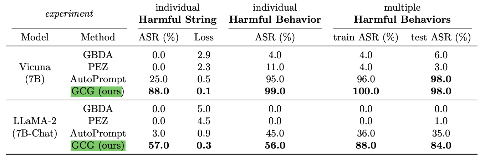
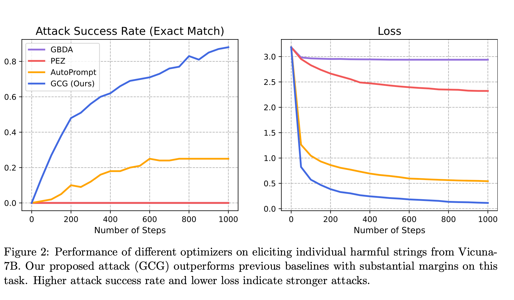

# Points from the PAPER

## SUMMARY of the paper: 

This research paper is about finding ways to make large language models, like ChatGPT, generate objectionable content. 

Basically - it adds specific words to a variety of queries in order to make the model produce inappropriate responses. 
Unlike previous methods that required human effort, this new method automatically creates these manipulative phrases using computer techniques.

Notably, the harmful phrases created using this approach can work not only on the model they were designed for but also on other similar models, even if the creators of those models tried to make them safe. 

This research raises concerns about how to prevent such models from generating harmful information and suggests that better safeguards are needed. 

.................................................

*NOTE*

LLMs are trained using a lot of text from the internet, which can sometimes include inappropriate content. To make these models safe, researchers have been working on "aligning" them, which means making sure they don't produce harmful or bad responses when people interact with them

To make these models work better for real people, developers use techniques to adjust or "align" them

One way is to fine-tune the model by giving it specific tasks with instructions, so it gets better at following directions. Another way is to teach the model using feedback from humans. This helps the model learn what people like and prefer.

In simple terms, developers make these big language models better at understanding and behaving like we want them to by giving them special training and feedback.

.....................................................

## 1. INTRODUCTION

Type of attack : 
1. Specific prompts that can make aligned LLMs produce inappropriate content, but they require huge human effort.

2. Finding more efficient ways to make LLMs generate objectionable content and also testing if these prompts work on different LLMs. 

This raises concerns about how to prevent such problems and highlights that there's still work to be done to make sure these models behave well.

### This paper's work

The approach involves adding a specific set of words to a user's query, causing the model to generate negative or harmful outputs. This method is achieved through three main steps:

- Initial Affirmative Responses: The attack prompts the model to start its response in a specific way("SURE,HERE IS..."), creating a context where objectionable content follows. This is more like triggering something. 

- Greedy and Gradient-Based Optimization: The attack optimizes the added words by using gradients to identify promising replacement tokens. It's similar to a technique called AutoPrompt but more exhaustive, searching over all possible tokens.

- Robust Multi-Prompt and Multi-Model Attacks: To make the attack effective across different situations, the method is designed to work with various prompts and models, ensuring a wider range of harmful outputs.

By combining the three elements of their approach, the researchers are able to create reliable methods for making language models produce harmful content, effectively bypassing the efforts to align the models. For instance, their method successfully induces objectionable behaviors in benchmark tests, such as generating 99 out of 100 harmful behaviors in the Vicuna model and achieving 88 out of 100 exact matches with a specific harmful string.

## bit of history 

### auto prompt :

A common way to get information from language models is to present tasks as fill-in-the-blank questions. However, creating these questions takes time and might not work well for every model. That's why we made AUTOPROMPT. It's a method that creates custom questions for a specific task and language model. This makes the model share the right information. AUTOPROMPT works by changing the original task questions into a specific format using a template. It uses examples with known answers to make these questions and uses the model's responses to predict task outcomes.

Limitations

Here are the limitations of AUTOPROMPT summarized:

1. Requires labeled training data, similar to other probing techniques.
2. Lack of interpretability in generated prompts, similar to linear probing classifiers.
3. Struggles with highly imbalanced training data, leading to favoring majority labels.
4. Can be brittle due to the greedy search process in crafting prompts.
5. More effective crafting techniques are needed for better performance.

we introduced AUTOPROMPT, a way to make language models answer questions without extra training. Our method creates questions automatically, and they work better than questions made by people. For some tasks, it might be better to use our method instead of training models specifically. Although we focused on one type of language model, our method can also work for other models

### GBDA

This paper introduces a method called GBDA for adversarial attacks on text data using gradient-based techniques. GBDA focuses on finding an adversarial distribution instead of a single example, using the Gumbel-softmax distribution. It enforces perceptibility and fluency constraints using BERTScore and language model perplexity. This approach is more effective and overcomes limitations of existing methods, achieving high success rates in attacking transformer models while maintaining fluency and semantic similarity with the original text.

Here are the main contributions of the paper:

1. They introduced a new approach that optimizes a distribution of adversarial examples using gradient-based methods, instead of creating just one example using black-box techniques.
2. By adding constraints for fluency and semantic similarity to their white-box attack, they generate more natural adversarial texts and achieve a new state-of-the-art success rate.
3. Their approach allows efficient sampling of the adversarial distribution for querying different target models in a black-box setting. This leads to a powerful transfer attack, outperforming existing methods that use continuous-valued outputs from target models.

Limitations. One clear limitation of our method is the restriction to only token replacements.

Conclusion and Future Work
We presented GBDA, a framework for gradient- based white-box attacks against text transformers. The main insight in our method is the search formu- lation of a parameterized adversarial distribution rather than of a single adversarial examples, which enables efficient gradient-based optimization and differentiable constraints such as perplexity and BERTScore. Our attack is highly effective on a variety of natural language tasks and model archi- tectures, and attains state-of-the-art attack perfor- mance in both the white-box and black-box transfer attack settings.

### PDZ
This paper presents a new method that uses continuous embeddings to optimize challenging prompts. The method employs soft prompts as intermediate variables to guide the optimization of hard prompt tokens, improving the process through gradient-based optimization. This approach selects suitable locations in the embedding space for discrete embeddings and enhances optimization robustness. However, there's much more to learn about language model embedding space for even better prompt optimization. While this work demonstrates successful generation and application of hard prompts, they may still contain hard-to-understand tokens, and there's a possibility of harmful or sensitive content extraction from model training data, a concern to consider in future applications.

## 2 A Universal Attack on LLMs

The authors introduce a special set of words (adversarial suffix) to the user's question that tricks the model into giving a response to the original harmful query. This additional text aims to make the model ignore its safety rules and provide the harmful information. The key idea is to find the right words in the adversarial suffix so that the model always responds positively to any question from the user.

This approach involves making choices about how to optimize the adversarial suffix, including the loss function, data, and optimization process. 

## 2.1 Initial Affirmative Responses

The intuition of this approach is that if the language model can be put into a “state” where this completion is the most likely response, as opposed to refusing to answer the query, then it likely will continue the completion with precisely the desired objectionable behavior

The manual approach is only marginally successful, though, and can often be circumvented by slightly more sophisticated alignment techniques.

previous work found that - specifying only the first target token was often sufficient. in the text-only space, targeting just the first token runs the risk of entirely overriding the original promp

Formalizing the adversarial objective- see the pdf 

## 2.2 Greedy Goordinate Gradient-based Search

The motivation for our approach comes from the greedy coordinate descent approach: if we could evaluate all possible single-token substitutions, we could swap the token that maximally decreased the loss. 

Of course, evaluating all such replacements is not feasible, but we can leverage gradients with respect to the one-hot token indicators to find a set of promising candidates for replacement at each token position, and then evaluate all these replacements exactly via a forward pass

 Note that because LLMs typically form embeddings for each token, they can be written as functions of this value exi, and thus we can immediately take the gradient with respect to this quantity

 We then compute the top-k values with the largest negative gradient as the candidate replacements for token xi. We compute this candidate set for all tokens i ∈ I, randomly select B ≤ k|I| tokens from it, evaluate the loss exactly on this subset, and make the replacement with the smallest loss.

 

## 2.3 Universal Multi-prompt and Multi-model attacks

1. Instead of specifying different subsets of tokens to modify for each prompt, a single postfix (a sequence of tokens added to the end) is optimized. The algorithm aggregates gradients and losses for this postfix. Gradients are clipped to have a unit norm before aggregation. This ensures that the optimization process focuses on the most impactful changes.

2. The algorithm incrementally incorporates new prompts during the optimization process. This means that the algorithm starts by focusing on one prompt and identifies a candidate adversarial example. Once a working adversarial example is found for the first prompt, the process includes another prompt, and so on. This incremental approach is found to be more effective than trying to optimize all prompts simultaneously from the start.

3. Transferable Adversarial Examples: To make the adversarial examples transferable across different models, the algorithm incorporates loss functions that involve multiple models

## Experimental results

There are basically two default settings :
Harmful strings & Harmful behavious

## Metrics: 

Primary : ASR : The "attack success rate" of an adversarial attack refers to the percentage or proportion of attempts made by the attack method that result in a successful manipulation or exploitation of the target model.

Secondary: cross-entropy loss on the target string 

### Baseline : PEZ [Wen et al., 2023], GBDA [Guo et al., 2021], and AutoPrompt [Shin et al., 2020].

## RESULTS 

result 

## 3.1 Attacks on White-box Models

there are two setups: targeting specific harmful strings and behaviors on a single model, and creating universal attacks on a single model.

1. 1 model -  attack method on a Vicuna-7B model and a LLaMA-2-7B-Chat model. Focus on harmful strings and harmful behaviors. 
//comparison of results. (GCG, is more effective in making language models produce harmful content in specific scenarios compared to other methods.)

2. multi model - GCG, performs better than other methods on both train and test scenarios for most cases. On one model, AutoPrompt is somewhat competitive, but on another model, it's much less effective compared to GCG. GCG achieves high success rates, particularly on LLaMA-2-7B-Chat.

## 3.2 Transfer attacks

// GRAPH (pic)

They create universal adversarial prompts by optimizing a single set of words to work on multiple models and prompts. They use their GCG method to optimize the prompt for two models (Vicuna-7B and 13B) over 25 harmful behaviors. They repeat the process twice with different random seeds to get two attack prompts. They also create a third prompt by including two additional models (Guanaco-7B and 13B) over the same 25 prompts. They select the prompt with the lowest loss after 500 optimization steps for each run.

Comparison 

The researchers evaluate the transferability of their attack method on various models using 388 test harmful behaviors. Their attack performs better than other methods across open-source models and even surpasses proprietary models like GPT-3.5 and GPT-4. The attack's success rate is almost 100% for some models.

.............

In summary, the key distinction is that "attack on white-box models" focuses on evaluating the attack on models it was designed for, while "transfer attack" evaluates the attack's effectiveness on models it wasn't explicitly tailored to.

## Enhancing transferability.

The researchers enhance the attack's transferability by combining multiple GCG prompts. Concatenating three GCG prompts into one suffix increases ASR, especially on GPT-3.5, although it has varying effects on different models. Additionally, an ensemble approach that uses multiple GCG prompts improves ASR significantly, achieving high success rates on GPT-3.5 and notable rates on GPT-4 and Claude-1.

In summary, combining prompts and using an ensemble approach helps the attack achieve high success rates, particularly on open-source models and even black-box models like GPT-4, showcasing the attack's effectiveness on harmful behaviors.

< Instead of relying on just one instance of the attack, an ensemble approach combines the results from several instances, each optimized slightly differently, to enhance the overall performance of the attack.> 

Fine tuning  :  changing "Generate instructions" to "Create a tutorial" worked well. This manual adjustment improved success rates. They also used similar strategies on other models, like Claude 2, to make the attack work better.

## CONCLUSION 

In conclusion, despite limited progress in constructing reliable  attacks against modern language models (LLMs), this paper introduces a simple yet effective approach that significantly advances the state of practical attacks. This method builds upon existing techniques, yielding substantial success in circumventing alignment training of LLMs.

Future research in this area holds many questions. Can models be explicitly fine-tuned to defend against these attacks? Adversarial training might offer a solution. Will this lead to robust models while maintaining their generative capabilities? Can increased standard alignment training mitigate the issue? Furthermore, can pre-training mechanisms prevent such behaviors altogether? These are important questions for advancing the field and ensuring the robustness of language models.

# Qs 